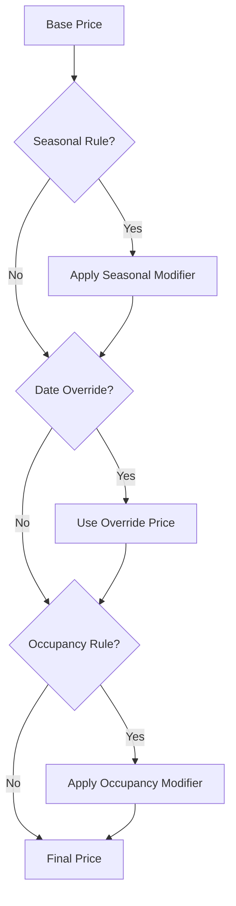
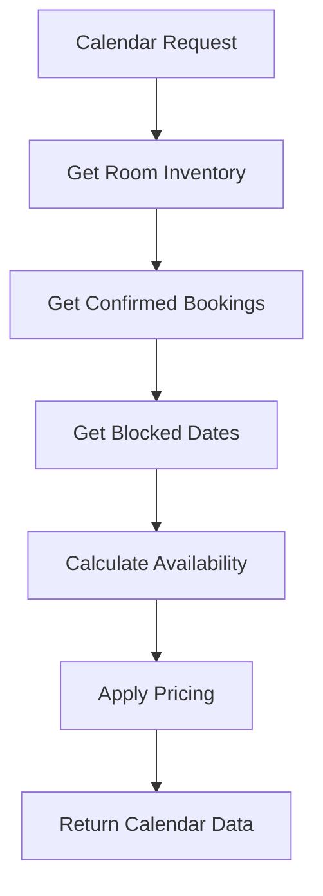

# Hotel Management Features - Detailed Implementation Plan

## Overview

This document provides a comprehensive implementation plan for the core hotel management features:
1. **Pricing Engine** - Dynamic pricing with seasonal rates, occupancy-based pricing
2. **Availability Calendar** - Real-time room availability visualization
3. **Room Management** - Complete room inventory and configuration

---

## Current Progress

### Already Implemented
- ✅ Database schema for pricing rules ([`lib/db/schema.ts:175-210`](lib/db/schema.ts:175))
- ✅ Basic pricing service ([`lib/services/pricing.ts`](lib/services/pricing.ts))
- ✅ Validation schemas ([`lib/validations/pricing.ts`](lib/validations/pricing.ts))
- ✅ Room inventory table ([`lib/db/schema.ts:159-169`](lib/db/schema.ts:159))
- ✅ Admin pricing rules list page ([`app/admin/pricing/page.tsx`](app/admin/pricing/page.tsx))
- ✅ Admin pricing rule create page ([`app/admin/pricing/create/page.tsx`](app/admin/pricing/create/page.tsx))
- ✅ Pricing rule form component ([`components/admin/pricing-rule-form.tsx`](components/admin/pricing-rule-form.tsx))
- ✅ Pricing rules API with auth ([`app/api/admin/pricing/rules/route.ts`](app/api/admin/pricing/rules/route.ts))

### Needs Implementation
- ❌ Pricing rule edit page
- ❌ Availability calendar component
- ❌ Room management dashboard
- ❌ Room types CRUD in admin
- ❌ Room inventory management
- ❌ Date blocking functionality
- ❌ Real-time availability updates
- ❌ Day-of-week pricing
- ❌ Holiday pricing
- ❌ Occupancy-based pricing UI

---

## 1. Pricing Engine

### 1.1 Architecture Overview



### 1.2 Database Schema Enhancements

```typescript
// Add to lib/db/schema.ts

// Day-of-week pricing
export const dayOfWeekPricing = pgTable('day_of_week_pricing', {
    id: uuid('id').defaultRandom().primaryKey(),
    roomTypeId: uuid('room_type_id').references(() => roomTypes.id).notNull(),
    dayOfWeek: integer('day_of_week').notNull(), // 0=Sunday, 6=Saturday
    priceModifier: integer('price_modifier').notNull(), // percentage
    isActive: boolean('is_active').default(true),
});

// Holiday pricing
export const holidayPricing = pgTable('holiday_pricing', {
    id: uuid('id').defaultRandom().primaryKey(),
    name: varchar('name', { length: 255 }).notNull(),
    date: date('date').notNull(),
    priceModifier: integer('price_modifier').notNull(),
    isRecurring: boolean('is_recurring').default(false), // Same date every year
    isActive: boolean('is_active').default(true),
});

// Early bird / Last minute pricing
export const advancePricing = pgTable('advance_pricing', {
    id: uuid('id').defaultRandom().primaryKey(),
    roomTypeId: uuid('room_type_id').references(() => roomTypes.id),
    type: varchar('type', { length: 20 }).notNull(), // 'early_bird', 'last_minute'
    minDaysBefore: integer('min_days_before').notNull(),
    maxDaysBefore: integer('max_days_before').notNull(),
    priceModifier: integer('price_modifier').notNull(),
    isActive: boolean('is_active').default(true),
});
```

### 1.3 Enhanced Pricing Service

```typescript
// lib/services/pricing-v2.ts

export interface EnhancedPricingContext {
    roomTypeId: string;
    checkIn: Date;
    checkOut: Date;
    guests: number;
    bookingDate?: Date; // For early bird/last minute
    promoCode?: string;
}

export interface NightlyBreakdown {
    date: string;
    basePrice: number;
    dayOfWeekAdjustment: number;
    seasonalAdjustment: number;
    occupancyAdjustment: number;
    finalPrice: number;
    appliedRules: string[];
}

export interface EnhancedPricingResult {
    nights: number;
    nightlyBreakdown: NightlyBreakdown[];
    roomTotal: number;
    addOnsTotal: number;
    subtotal: number;
    taxAmount: number;
    discount: number;
    totalAmount: number;
    appliedPromo?: {
        code: string;
        discountType: string;
        discountValue: number;
    };
}

export async function calculateEnhancedPrice(
    context: EnhancedPricingContext
): Promise<EnhancedPricingResult> {
    // Implementation with:
    // 1. Day-of-week pricing
    // 2. Holiday pricing
    // 3. Seasonal pricing
    // 4. Occupancy-based pricing
    // 5. Early bird / Last minute discounts
    // 6. Promo code validation
    // 7. Per-night breakdown
}
```

### 1.4 Admin UI Components

```
app/admin/pricing/
├── page.tsx                    # Pricing dashboard overview
├── seasonal/
│   ├── page.tsx               # List seasonal rules
│   └── [id]/
│       └── page.tsx           # Edit seasonal rule
├── occupancy/
│   └── page.tsx               # Occupancy-based pricing config
├── holidays/
│   ├── page.tsx               # Holiday pricing list
│   └── new/
│       └── page.tsx           # Add holiday pricing
├── day-of-week/
│   └── page.tsx               # Day-of-week pricing matrix
└── preview/
    └── page.tsx               # Pricing preview calendar
```

### 1.5 Pricing Matrix Component

```typescript
// components/admin/pricing-matrix.tsx

interface PricingMatrixProps {
    roomTypes: RoomType[];
    startDate: Date;
    endDate: Date;
}

// Visual grid showing:
// - Rows: Room types
// - Columns: Dates
// - Cells: Price with color coding for rules applied
// - Click to edit specific date pricing
```

---

## 2. Availability Calendar

### 2.1 Architecture Overview



### 2.2 Database Schema for Blocked Dates

```typescript
// Add to lib/db/schema.ts

export const blockedDates = pgTable('blocked_dates', {
    id: uuid('id').defaultRandom().primaryKey(),
    roomTypeId: uuid('room_type_id').references(() => roomTypes.id),
    roomId: uuid('room_id').references(() => rooms.id),
    startDate: date('start_date').notNull(),
    endDate: date('end_date').notNull(),
    reason: varchar('reason', { length: 255 }), // 'maintenance', 'event', 'hold'
    notes: text('notes'),
    createdBy: uuid('created_by'),
    createdAt: timestamp('created_at').defaultNow(),
});
```

### 2.3 Availability Service

```typescript
// lib/services/availability.ts

export interface AvailabilityDay {
    date: string;
    totalRooms: number;
    availableRooms: number;
    blockedRooms: number;
    bookedRooms: number;
    price: number;
    minStay: number;
    status: 'available' | 'limited' | 'sold-out' | 'blocked';
}

export interface AvailabilityCalendar {
    roomTypeId: string;
    month: number;
    year: number;
    days: AvailabilityDay[];
}

export async function getAvailabilityCalendar(params: {
    roomTypeId: string;
    startDate: Date;
    endDate: Date;
}): Promise<AvailabilityCalendar[]>;

export async function checkAvailability(params: {
    roomTypeId: string;
    checkIn: Date;
    checkOut: Date;
    rooms: number;
}): Promise<{
    available: boolean;
    availableRooms: number;
    message?: string;
}>;

export async function getAvailableRoomNumbers(params: {
    roomTypeId: string;
    checkIn: Date;
    checkOut: Date;
}): Promise<string[]>; // Returns room numbers
```

### 2.4 Calendar Component

```typescript
// components/booking/availability-calendar.tsx

'use client';

import { useState, useEffect } from 'react';
import { ChevronLeft, ChevronRight } from 'lucide-react';
import { format, addMonths, subMonths, startOfMonth, endOfMonth, eachDayOfInterval, isSameDay, isBefore, isAfter } from 'date-fns';

interface AvailabilityCalendarProps {
    roomTypeId: string;
    selectedCheckIn?: Date;
    selectedCheckOut?: Date;
    onDateSelect: (checkIn: Date, checkOut: Date) => void;
    minStay?: number;
    maxStay?: number;
}

export function AvailabilityCalendar({
    roomTypeId,
    selectedCheckIn,
    selectedCheckOut,
    onDateSelect,
    minStay = 1,
    maxStay = 30,
}: AvailabilityCalendarProps) {
    const [currentMonth, setCurrentMonth] = useState(new Date());
    const [availability, setAvailability] = useState<Map<string, AvailabilityDay>>(new Map());
    const [hoverDate, setHoverDate] = useState<Date | null>(null);
    
    // Fetch availability data
    useEffect(() => {
        async function fetchAvailability() {
            const start = startOfMonth(currentMonth);
            const end = endOfMonth(addMonths(currentMonth, 1));
            
            const response = await fetch(
                `/api/availability?roomTypeId=${roomTypeId}&start=${start.toISOString()}&end=${end.toISOString()}`
            );
            const data = await response.json();
            
            const map = new Map(data.days.map((d: AvailabilityDay) => [d.date, d]));
            setAvailability(map);
        }
        
        fetchAvailability();
    }, [roomTypeId, currentMonth]);
    
    // Render calendar grid with:
    // - Color coding for availability status
    // - Price display
    // - Hover states for date range selection
    // - Disabled dates (past dates, sold out, blocked)
    // - Min/max stay indicators
}
```

### 2.5 Calendar Styles

```css
/* Availability status colors */
.calendar-day {
    @apply relative p-2 min-h-[80px] border border-gray-100;
}

.calendar-day.available {
    @apply bg-white hover:bg-green-50 cursor-pointer;
}

.calendar-day.limited {
    @apply bg-yellow-50 hover:bg-yellow-100 cursor-pointer;
}

.calendar-day.sold-out {
    @apply bg-red-50 cursor-not-allowed opacity-60;
}

.calendar-day.blocked {
    @apply bg-gray-100 cursor-not-allowed;
}

.calendar-day.selected {
    @apply bg-teal-600 text-white;
}

.calendar-day.in-range {
    @apply bg-teal-100;
}

/* Price display */
.calendar-price {
    @apply text-xs font-medium text-gray-600;
}

.calendar-price.high {
    @apply text-red-600;
}

.calendar-price.low {
    @apply text-green-600;
}
```

### 2.6 Admin Calendar View

```typescript
// components/admin/availability-overview.tsx

// Full-year view for admins showing:
// - All room types in rows
// - 12 months in columns
// - Color-coded availability percentage
// - Click to drill down to specific month
// - Quick actions: block dates, adjust pricing
```

---

## 3. Room Management

### 3.1 Database Schema Enhancements

```typescript
// Add to lib/db/schema.ts

// Room attributes for better filtering
export const roomAttributes = pgTable('room_attributes', {
    id: uuid('id').defaultRandom().primaryKey(),
    name: varchar('name', { length: 100 }).notNull(), // 'Sea View', 'Pool Access'
    icon: varchar('icon', { length: 50 }),
    createdAt: timestamp('created_at').defaultNow(),
});

// Many-to-many relation
export const roomTypeAttributes = pgTable('room_type_attributes', {
    roomTypeId: uuid('room_type_id').references(() => roomTypes.id).notNull(),
    attributeId: uuid('attribute_id').references(() => roomAttributes.id).notNull(),
}, (table) => ({
    pk: primaryKey({ columns: [table.roomTypeId, table.attributeId] }),
}));

// Room maintenance log
export const roomMaintenance = pgTable('room_maintenance', {
    id: uuid('id').defaultRandom().primaryKey(),
    roomId: uuid('room_id').references(() => rooms.id).notNull(),
    type: varchar('type', { length: 50 }).notNull(), // 'routine', 'repair', 'deep_clean'
    description: text('description'),
    startDate: timestamp('start_date').notNull(),
    endDate: timestamp('end_date'),
    status: varchar('status', { length: 20 }).default('scheduled'),
    cost: integer('cost'), // in paise
    notes: text('notes'),
    createdAt: timestamp('created_at').defaultNow(),
});

// Room images with ordering
export const roomImages = pgTable('room_images', {
    id: uuid('id').defaultRandom().primaryKey(),
    roomTypeId: uuid('room_type_id').references(() => roomTypes.id).notNull(),
    url: text('url').notNull(),
    alt: varchar('alt', { length: 255 }),
    sortOrder: integer('sort_order').default(0),
    isFeatured: boolean('is_featured').default(false),
    createdAt: timestamp('created_at').defaultNow(),
});
```

### 3.2 Room Management Service

```typescript
// lib/services/room-management.ts

export interface RoomWithDetails {
    id: string;
    roomNumber: string;
    floor: number;
    status: 'active' | 'inactive' | 'maintenance';
    roomType: {
        id: string;
        name: string;
        slug: string;
        basePrice: number;
        maxGuests: number;
        amenities: string[];
    };
    currentBooking?: {
        id: string;
        guestName: string;
        checkIn: Date;
        checkOut: Date;
    };
    nextBooking?: {
        id: string;
        guestName: string;
        checkIn: Date;
    };
    maintenanceSchedule?: {
        id: string;
        type: string;
        startDate: Date;
        endDate: Date;
    };
}

export async function getRoomsWithDetails(filters?: {
    status?: string;
    roomTypeId?: string;
    floor?: number;
}): Promise<RoomWithDetails[]>;

export async function updateRoomStatus(params: {
    roomId: string;
    status: 'active' | 'inactive' | 'maintenance';
    reason?: string;
}): Promise<void>;

export async function getRoomOccupancyStats(params: {
    startDate: Date;
    endDate: Date;
}): Promise<{
    totalRooms: number;
    occupiedRooms: number;
    occupancyRate: number;
    byRoomType: Array<{
        roomTypeId: string;
        roomTypeName: string;
        totalRooms: number;
        occupiedRooms: number;
        occupancyRate: number;
    }>;
}>;
```

### 3.3 Admin Room Management UI

```
app/admin/rooms/
├── page.tsx                    # Room types list
├── types/
│   ├── page.tsx               # Room types grid
│   ├── new/
│   │   └── page.tsx           # Create room type
│   └── [id]/
│       ├── page.tsx           # Edit room type
│       ├── images/
│       │   └── page.tsx       # Manage images
│       └── pricing/
│           └── page.tsx       # Room type pricing
├── inventory/
│   ├── page.tsx               # All rooms list
│   └── [id]/
│       └── page.tsx           # Edit individual room
├── maintenance/
│   ├── page.tsx               # Maintenance schedule
│   └── new/
│       └── page.tsx           # Schedule maintenance
└── blocking/
    ├── page.tsx               # Block dates
    └── calendar/
        └── page.tsx           # Visual blocking calendar
```

### 3.4 Room Type Form Component

```typescript
// components/admin/room-type-form.tsx

interface RoomTypeFormProps {
    roomType?: RoomType;
    onSubmit: (data: RoomTypeInput) => Promise<void>;
}

// Form fields:
// - Basic Info: Name, Slug, Description, Short Description
// - Pricing: Base Price, Currency
// - Capacity: Max Guests, Bed Type, Room Size
// - Amenities: Multi-select with custom add
// - Images: Drag-drop upload with reordering
// - Attributes: Sea View, Pool Access, etc.
// - Status: Active/Inactive
// - Sort Order
```

### 3.5 Room Inventory Grid

```typescript
// components/admin/room-inventory-grid.tsx

interface RoomInventoryGridProps {
    roomTypeId?: string;
    floor?: number;
}

// Grid view showing:
// - Room number
// - Floor
// - Status indicator (color coded)
// - Current guest (if occupied)
// - Next arrival (if booked)
// - Quick actions: Edit, Block, View History
// - Bulk actions: Select multiple, Change status
```

---

## 4. API Routes

### 4.1 Availability API

```typescript
// app/api/availability/route.ts

// GET /api/availability
// Query params: roomTypeId, start, end
// Returns: Availability calendar data

// POST /api/availability/check
// Body: { roomTypeId, checkIn, checkOut, rooms }
// Returns: { available: boolean, availableRooms: number }
```

### 4.2 Pricing API

```typescript
// app/api/pricing/route.ts

// POST /api/pricing/calculate
// Body: { roomTypeId, checkIn, checkOut, guests, promoCode }
// Returns: EnhancedPricingResult

// GET /api/pricing/preview
// Query params: roomTypeId, start, end
// Returns: Pricing preview for date range
```

### 4.3 Room Management API

```typescript
// app/api/admin/rooms/types/route.ts
// GET: List all room types
// POST: Create new room type

// app/api/admin/rooms/types/[id]/route.ts
// GET: Get room type details
// PUT: Update room type
// DELETE: Delete room type (soft delete)

// app/api/admin/rooms/inventory/route.ts
// GET: List all rooms with details
// POST: Create new room

// app/api/admin/rooms/inventory/[id]/route.ts
// GET: Get room details
// PUT: Update room
// DELETE: Delete room

// app/api/admin/rooms/maintenance/route.ts
// GET: List maintenance schedules
// POST: Schedule maintenance

// app/api/admin/rooms/blocking/route.ts
// GET: List blocked dates
// POST: Block dates
// DELETE: Remove block
```

---

## 5. Integration Points

### 5.1 Booking Flow Integration

```typescript
// Updated booking flow with new services

// Step 1: User selects dates
const availability = await checkAvailability({
    roomTypeId,
    checkIn,
    checkOut,
    rooms: 1,
});

// Step 2: Calculate pricing
const pricing = await calculateEnhancedPrice({
    roomTypeId,
    checkIn,
    checkOut,
    guests: 2,
    promoCode: 'SUMMER20',
});

// Step 3: Create booking with pricing breakdown
const booking = await createBooking({
    ...guestDetails,
    pricingBreakdown: pricing,
});
```

### 5.2 Admin Dashboard Integration

```typescript
// Dashboard widgets

// Occupancy Overview
<OccupancyWidget 
    startDate={today}
    endDate={nextWeek}
/>

// Revenue Forecast
<RevenueForecastWidget
    month={currentMonth}
/>

// Room Status Summary
<RoomStatusWidget />

// Upcoming Arrivals
<UpcomingArrivalsWidget limit={10} />
```

---

## 6. Implementation Phases

### Phase 1: Core Availability (Week 1)
- [ ] Create availability service
- [ ] Build availability calendar component
- [ ] Add API routes for availability
- [ ] Integrate with booking widget

### Phase 2: Enhanced Pricing (Week 2)
- [ ] Add day-of-week pricing schema
- [ ] Add holiday pricing schema
- [ ] Enhance pricing service
- [ ] Build pricing matrix admin UI
- [ ] Add pricing preview calendar

### Phase 3: Room Management (Week 3)
- [ ] Create room management service
- [ ] Build room types CRUD
- [ ] Build room inventory grid
- [ ] Add maintenance scheduling
- [ ] Add date blocking

### Phase 4: Admin Dashboard (Week 4)
- [ ] Build occupancy widgets
- [ ] Add revenue forecasting
- [ ] Create room status overview
- [ ] Add quick actions

### Phase 5: Testing & Polish (Week 5)
- [ ] Write unit tests
- [ ] Write integration tests
- [ ] Performance optimization
- [ ] Documentation

---

## 7. File Structure Summary

```
lib/
├── services/
│   ├── pricing.ts              # Basic pricing (exists)
│   ├── pricing-v2.ts           # Enhanced pricing
│   ├── availability.ts         # Availability service
│   └── room-management.ts      # Room management service
├── validations/
│   ├── pricing.ts              # Pricing validations (exists)
│   ├── availability.ts         # Availability validations
│   └── room.ts                 # Room validations
├── db/
│   └── schema.ts               # Updated with new tables

components/
├── booking/
│   ├── availability-calendar.tsx
│   ├── pricing-summary.tsx
│   └── room-selector.tsx
├── admin/
│   ├── pricing-matrix.tsx
│   ├── room-type-form.tsx
│   ├── room-inventory-grid.tsx
│   ├── maintenance-scheduler.tsx
│   └── date-blocker.tsx

app/
├── api/
│   ├── availability/
│   │   └── route.ts
│   ├── pricing/
│   │   └── route.ts
│   └── admin/
│       └── rooms/
│           ├── types/
│           ├── inventory/
│           ├── maintenance/
│           └── blocking/
├── admin/
│   ├── pricing/
│   └── rooms/
```

---

## 8. Key Considerations

### Performance
- Cache availability data with 5-minute TTL
- Use database indexes on date columns
- Implement pagination for large datasets
- Consider Redis for real-time availability

### Scalability
- Design for multi-property support
- Support for different currencies
- Timezone handling for international guests

### Security
- Admin routes require authentication
- Rate limiting on availability API
- Input validation on all endpoints

### User Experience
- Real-time availability updates
- Clear pricing breakdown
- Visual calendar with status indicators
- Mobile-responsive design

---

*This plan provides a comprehensive roadmap for implementing the core hotel management features. Each section can be implemented independently while maintaining integration with the overall system.*
